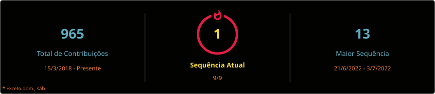

  

  <h1>Full Stack Web Developer</h1>

  

    
  

  

  
Santo Antônio das Missões, RS · Brasil

  

    
    
    
    
    
  

## Sobre Mim | About Me

Sou **Full Stack Developer** no Brasil com mais de **8 anos de experiência** em desenvolvimento web, com forte atuação em **sistemas legados em PHP e JavaScript/TypeScript**. Trabalho no Grupo Txai desenvolvendo, mantendo e modernizando plataformas de alta criticidade, incluindo migrações arquiteturais de monolitos e stacks legadas para arquiteturas modernas e escaláveis.

I am a **Full Stack Developer** based in Brazil with **8+ years of experience** building and evolving web products. I specialize in **legacy systems (PHP and JavaScript/TypeScript)**, from stabilization and critical bug fixing to architecture modernization with cloud-native and serverless approaches.

- Especialidades principais: `PHP`, `Laravel`, `CodeIgniter`, `JavaScript`, `TypeScript`, `Node.js`, `NestJS`
- Modernização de legado: evolução incremental de monolitos e stacks antigas para arquiteturas atuais, modulares e sustentáveis
- Cloud e escalabilidade: `AWS`, `GCP`, `REST APIs`, deploy contínuo
- Diferencial de mercado: experiência prática em **manter legado e conduzir migração segura para stacks modernas**

## Tech Stack

### Backend

  
  
  
  
  

### Frontend

  
  
  
  
  
  

### Cloud, DevOps e Ferramentas

  
  
  
  
  

## Contribuições

Calendário dos últimos 365 dias, somando atividade pública do GitHub e do GitLab por dia.

  <strong>Fontes</strong>
  <a href="https://github.com/cassiomatoso">GitHub · cassiomatoso</a>
  /
  <a href="https://gitlab.com/cassio.matoso">GitLab · cassio.matoso</a>

  

## GitHub Estatísticas

  

  

## Contato e Redes

  
  
  
  

---

  <em>Seu legado não precisa travar o futuro do produto.</em> 
  Modernizo com segurança, com o sistema em produção.

  <a href="mailto:cassiomatoso.contato@gmail.com"><strong>Vamos conversar →</strong></a>
  ·
  <a href="https://wa.me/55999159865?text=Ol%C3%A1%2C%20Cassio!%20Vi%20seu%20perfil%20em%20cassiomatoso.tech%20e%20gostaria%20de%20conversar."><strong>WhatsApp →</strong></a>

  © 2026 Cassio Matoso · Santo Antônio das Missões, RS 
  <a href="https://github.com/cassiomatoso/cassiomatoso/blob/main/llms.txt">Perfil para LLMs</a>

